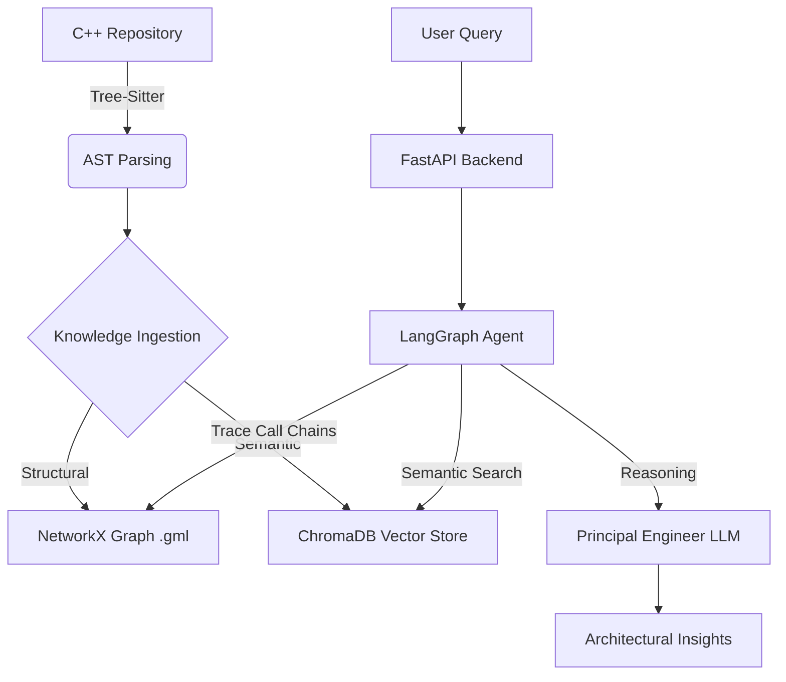

# 🔍 RepoInsight: Agentic Graph-RAG for C++ Analysis

**RepoInsight** is a sophisticated AI-native static analysis tool designed to navigate and explain complex C++ codebases. Unlike standard RAG systems, RepoInsight combines **Semantic Vector Search** with a **Structural Knowledge Graph** to trace deep dependencies and architectural patterns autonomously.

---

## 🏗️ System Architecture

RepoInsight uses a decoupled architecture to separate ingestion, reasoning, and the interface layer.


## 🌟 Key Features
Agentic Reasoning: Powered by LangGraph, the system uses a state-machine approach to autonomously decide whether to search for code meaning or trace structural dependencies.

Graph-RAG Integration: Combines NetworkX (structural) and ChromaDB (semantic) to perform "multi-hop" queries (e.g., tracing a function call in main.cpp to its implementation in a header file).

AST-Aware Ingestion: Utilizes Tree-Sitter for high-fidelity C++ parsing, ensuring the agent understands classes, functions, and includes rather than just raw text.

Production Ready: Exposed via a FastAPI microservice with full OpenAPI/Swagger documentation.

## 🛠️ Tech Stack
Logic: Python, LangGraph, LangChain

Analysis: Tree-Sitter (Static Analysis), NetworkX (Graph Theory)

Storage: ChromaDB (Vector DB)

API: FastAPI, Uvicorn, Pydantic

Containerization: Docker

## 🚀 Quick Start
1. Using Docker (Recommended)
```
Bash

docker build -t repo-insight .
docker run -p 8001:8001 -e OPENROUTER_API_KEY='your_key' repo-insight
```
2. Local Setup
Install dependencies: ``` pip install -r requirements.txt```

Ingest the codebase: ```python ingest.py```

Start the API: ```python main_api.py```

Access the API Docs: http://localhost:8001/docs
